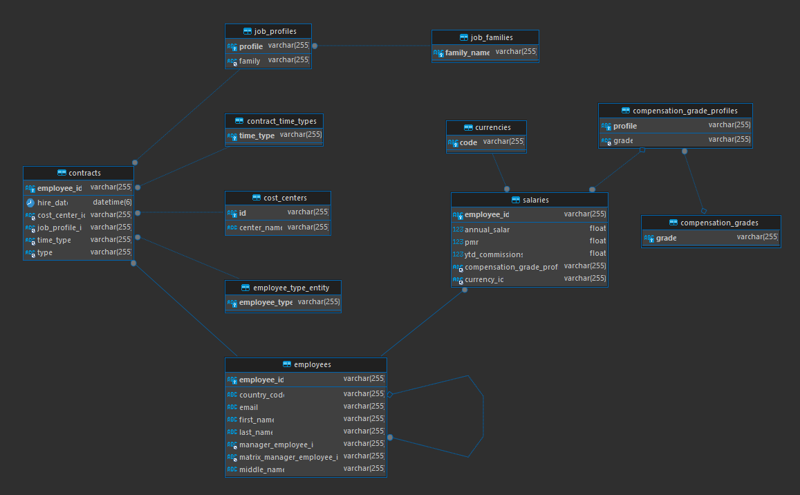

# Prueba Técnica por Santiago Alonso

El presente código representa una prueba técnica, cuyo objetivos son demostrar las capacidades en diferentes áreas y perfiles. El ejercicio consistió en la realización de un sistema en 3 niveles full-stack (Angular, Java Spring Boot y SQL) en tan solo 10 días. 
Decidí dar un enfoque especial al area BackEnd ya que es mi area de preferencia y el reto de probar un framework que nunca había usado. Probó una prueba interesante con retos desafiantes y satisfactorios, que me dió muchos conocimientos sobre el framework y sobre como abordar nuevas tecnologías en el futuro.
Se presenta:  
- Una API con Java Spring Boot: **ConsultingAPI**  
- Pagina Web en Angular que consume la API: **ConsultingWEB**  
- Dockerfiles y Docker Compose que construyen y ejecutan los previos componentes + una base de datos MySQL  
- Consultas SQL solicitadas (Ejer3y4)  

Para todos estos componentes se toma una postura al desarrollo enfocada a contruir lo solicitado dejando espacio para extender a futuro las funcionalidades necesarias, algunas ya predefinidas pero no implementadas.  

## Forma de ejecutar
- Requisitos:   
    - Docker y Docker Compose  
    - Tener los puertos [80, 8080, 3306] libres.

1. Clonar repositorio
2. En la carpeta que se clonó ejecutar el comando:  
    - ```$ docker compose up --build -d ```  
3. Esperar un momento a que se levanten los contenedores (puede tomar algunos minutos entre que se construye todo y se conectan back y bd)  
4. Los componentes se pueden acceder localmente:  
    - ConsultingWEB: [http://localhost:80](http://localhost:80)
    - ConsultingAPI: [Swagger Docs](http://localhost:8080)  
    - BD: [http://localhost:3306]() Credenciales: user: admin, password:admin  


## Diagrama de la Base de Datos  
  
*la relacion de empleado a empleado son las relaciones de manager y matrix manager entre empleados.  
